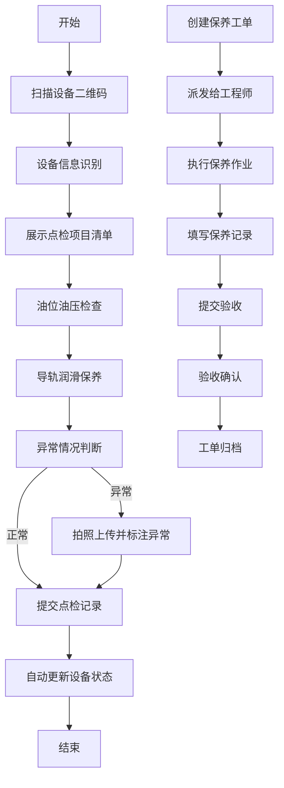

## 1. 产品概述

数控机床车间设备点检业务H5管理系统，用于设备科对车间机床设备进行全生命周期管理，包括台账管理、点检计划、扫码巡检、保养工单、维修报修、备件领用和停机统计七大核心模块。

- 主要目标：实现设备科对机床设备的数字化管理，提升设备运维效率，降低停机时间，保障生产安全
- 目标用户：设备科管理人员、维修工程师、点检员、操作员
- 核心价值：规范化点检保养流程、可追溯维修记录、精准备件管理、数据化设备健康分析

## 2. 核心功能

### 2.1 用户角色

| 角色 | 登录方式 | 核心权限 |
|------|----------|----------|
| 设备科管理员 | 账号密码登录 | 全模块操作、数据统计、用户管理 |
| 维修工程师 | 账号密码登录 | 保养工单处理、维修报修处理、备件领用 |
| 点检员 | 账号密码登录 | 扫码点检、油位油压检查、导轨润滑保养 |
| 操作员 | 账号密码登录 | 故障报修登记 |

### 2.2 功能模块

1. **设备台账**：机床设备信息管理，包含设备编号、型号、位置、状态、投用日期等
2. **点检计划**：点检任务排期管理，支持日检、周检、月检计划配置
3. **扫码点检**：扫码巡检打卡，油位油压检查，导轨润滑保养记录
4. **保养工单**：保养工单派发、接收、执行、验收全流程
5. **维修报修**：故障报修登记、维修过程记录、维修验收
6. **备件领用**：备件出库领用申请、审批、出库登记
7. **停机统计**：停机时长统计、设备完好率分析、保养到期提醒

### 2.3 页面详情

| 页面名称 | 模块名称 | 功能描述 |
|----------|----------|----------|
| 首页仪表板 | 数据概览 | 设备状态统计、今日点检任务、待处理工单、保养到期提醒、停机趋势图 |
| 设备台账 | 设备列表 | 设备卡片展示、搜索筛选、状态标识、详情查看 |
| 设备台账 | 设备详情 | 设备基本信息、点检记录、保养记录、维修记录、备件更换记录 |
| 点检计划 | 计划列表 | 点检计划卡片、周期设置、执行人分配、启停控制 |
| 点检计划 | 计划编辑 | 点检项目配置、检查标准、周期设置 |
| 扫码点检 | 扫码页面 | 二维码扫描、设备识别、点检项目列表 |
| 扫码点检 | 点检执行 | 油位油压数值录入、润滑保养确认、异常拍照上传 |
| 保养工单 | 工单列表 | 待派发、待执行、待验收、已完成工单分类展示 |
| 保养工单 | 工单详情 | 保养内容、执行步骤、材料清单、验收标准 |
| 维修报修 | 报修列表 | 待处理、维修中、已验收工单展示 |
| 维修报修 | 报修登记 | 故障类型选择、故障描述、照片上传、紧急程度 |
| 维修报修 | 维修记录 | 维修过程记录、更换备件、工时统计 |
| 备件领用 | 备件仓库 | 备件库存列表、库存预警、出入库记录 |
| 备件领用 | 领用申请 | 领用单填写、备件选择、数量、用途说明 |
| 停机统计 | 统计分析 | 停机时长排名、设备完好率、故障类型统计、月度趋势图 |
| 个人中心 | 用户信息 | 个人资料、修改密码、消息通知 |

## 3. 核心流程

### 3.1 点检执行流程

点检员登录系统 → 扫描设备二维码 → 系统展示点检项目清单 → 逐项检查并录入数据（油位油压读数/润滑确认）→ 异常情况拍照上报 → 提交点检记录 → 系统自动更新设备状态

### 3.2 保养工单流程

管理员创建保养计划 → 派发给指定工程师 → 工程师接收工单 → 执行保养（导轨润滑等）→ 填写保养记录 → 提交验收 → 管理员验收确认 → 工单归档

### 3.3 维修报修流程

操作员发现故障 → 提交报修单（故障描述+照片）→ 设备科派单 → 维修工程师接单 → 现场诊断维修 → 记录维修过程和更换备件 → 提交验收 → 操作员/管理员验收 → 工单完成

### 3.4 备件领用流程

申请人创建领用单 → 选择备件和数量 → 提交审批 → 管理员审批 → 仓库出库 → 系统扣减库存 → 更新备件台账

## 4. 用户界面设计

### 4.1 设计风格

- **主色调**：工业蓝色系 (#165DFF)，代表专业、可靠、科技感
- **辅助色**：
  - 绿色 (#00B42A)：表示正常、运行中、已完成
  - 橙色 (#FF7D00)：表示警告、保养中、待处理
  - 红色 (#F53F3F)：表示故障、异常、紧急
  - 灰色 (#86909C)：表示停机、离线
- **按钮风格**：圆角矩形按钮，点击有微缩动画反馈，主按钮采用蓝色渐变
- **字体**：
  - 标题：PingFang SC Bold，18-20px
  - 正文：PingFang SC Regular，14-16px
  - 数据数字：Roboto Mono，等宽字体
- **布局风格**：卡片式布局，顶部导航栏+底部Tab栏，页面间距16px
- **图标风格**：线性图标，统一24px尺寸，使用工业设备相关图标

### 4.2 页面设计概览

| 页面名称 | 模块名称 | UI元素 |
|----------|----------|--------|
| 首页仪表板 | 数据概览 | 顶部统计卡片网格、设备状态环形图、待办事项列表、保养到期滚动提醒、数据卡片悬浮阴影效果、数字滚动动画 |
| 设备台账 | 设备列表 | 搜索筛选栏、设备卡片（设备编号、状态标签、位置）、状态色块标识、下拉刷新、上拉加载 |
| 点检计划 | 计划列表 | 周期标签（日/周/月）、计划卡片（执行时间、执行人、进度条）、开关控件、滑动删除 |
| 扫码点检 | 扫码页面 | 全屏扫描框、动态扫描线、手电筒开关、相册选择、扫描成功震动反馈 |
| 扫码点检 | 点检执行 | 点检项列表、数值输入框、滑块控件、拍照上传按钮、正常/异常单选、提交按钮固定底部 |
| 保养工单 | 工单列表 | 状态筛选Tab、工单卡片（优先级标识、倒计时）、左右滑动快捷操作 |
| 维修报修 | 报修登记 | 故障类型选择器、多行文本输入、多图上传、紧急程度滑动选择、位置自动获取 |
| 备件领用 | 备件仓库 | 分类Tab、备件卡片（库存数字、库存进度条、预警角标）、搜索框 |
| 停机统计 | 统计分析 | 多种图表（柱状图、折线图、饼图）、时间筛选器、排名列表、数据导出按钮 |

### 4.3 响应式设计

- **设计原则**：移动端优先（H5页面），适配主流手机屏幕尺寸
- **适配范围**：320px - 768px 宽度，支持横竖屏切换
- **触摸优化**：
  - 按钮最小尺寸44x44px，确保手指点击区域
  - 支持左右滑动切换Tab、下拉刷新、上拉加载
  - 表单输入框自动弹出对应键盘类型（数字键盘用于数值录入）
- **断点设计**：
  - < 480px：单列布局，底部Tab导航
  - 480px - 768px：可展示双列卡片
  - > 768px：保持最大宽度768px居中显示

### 4.4 动效设计

- **页面切换**：左右滑动过渡动画，300ms ease-out
- **数据加载**：骨架屏占位，内容淡入显示
- **按钮交互**：点击缩放至0.96，释放回弹
- **状态变化**：状态标签切换时有颜色渐变过渡
- **图表动画**：数据加载时柱状图从底部升起，折线图从左到右绘制
- **提醒通知**：重要提醒从顶部滑入，停留3秒后滑出
