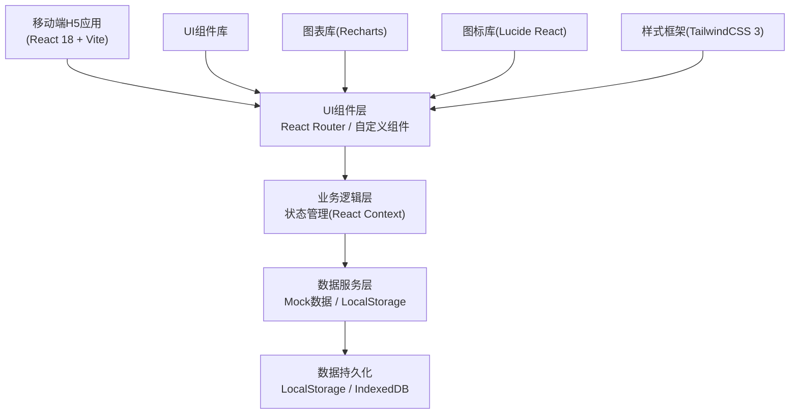
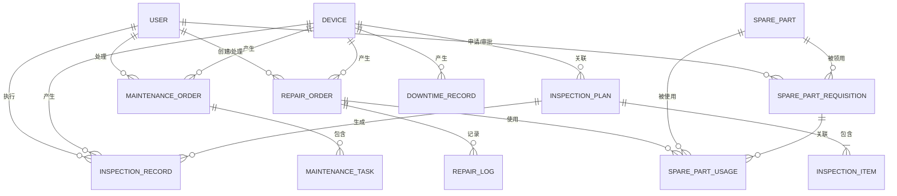

## 1. 架构设计



## 2. 技术描述

- **前端框架**：React 18 + TypeScript
- **构建工具**：Vite 5
- **样式框架**：TailwindCSS 3
- **路由管理**：React Router DOM 6
- **状态管理**：React Context + useReducer
- **图表库**：Recharts 2
- **图标库**：Lucide React
- **数据持久化**：LocalStorage + IndexedDB
- **后端**：无后端，使用Mock数据
- **数据库**：无数据库，前端数据持久化

### 技术选型说明

1. **React 18 + TypeScript**：提供类型安全和组件化开发能力，适合复杂业务系统
2. **TailwindCSS 3**：快速构建响应式UI，原子化CSS提高开发效率
3. **Recharts**：基于React的图表库，提供丰富的统计图表组件
4. **Lucide React**：轻量级图标库，工业风格线性图标
5. **React Router DOM 6**：单页应用路由管理，支持嵌套路由和动态路由

## 3. 路由定义

| 路由路径 | 页面名称 | 说明 |
|----------|----------|------|
| / | 登录页 | 用户登录入口 |
| /dashboard | 首页仪表板 | 数据概览、待办事项、设备状态统计 |
| /devices | 设备台账 | 设备列表展示 |
| /devices/:id | 设备详情 | 单台设备详细信息及历史记录 |
| /inspection-plans | 点检计划 | 点检计划列表管理 |
| /inspection-plans/:id | 计划编辑 | 点检计划编辑页面 |
| /scan | 扫码点检 | 二维码扫描页面 |
| /inspection/:deviceId | 点检执行 | 点检项目执行页面 |
| /maintenance | 保养工单 | 保养工单列表 |
| /maintenance/:id | 保养工单详情 | 工单详情与执行 |
| /repair | 维修报修 | 报修列表 |
| /repair/create | 报修登记 | 创建报修单 |
| /repair/:id | 维修记录 | 维修过程记录 |
| /spare-parts | 备件仓库 | 备件库存列表 |
| /spare-parts/requisition | 领用申请 | 备件领用申请 |
| /statistics | 停机统计 | 统计分析页面 |
| /profile | 个人中心 | 用户信息管理 |

## 4. 数据模型

### 4.1 数据模型ER图



### 4.2 数据实体定义

#### 设备(Device)
```typescript
interface Device {
  id: string;
  deviceNo: string;        // 设备编号
  name: string;            // 设备名称
  model: string;           // 设备型号
  manufacturer: string;    // 制造厂商
  location: string;        // 所在位置
  status: 'running' | 'standby' | 'maintenance' | 'fault' | 'offline';
  commissionDate: string;  // 投用日期
  lastMaintenanceDate: string;
  nextMaintenanceDate: string;
  lastInspectionDate: string;
  totalRunningHours: number;
  specifications: Record<string, string>;
  qrCode: string;
  createdAt: string;
  updatedAt: string;
}
```

#### 点检计划(InspectionPlan)
```typescript
interface InspectionPlan {
  id: string;
  deviceId: string;
  name: string;
  cycle: 'daily' | 'weekly' | 'monthly' | 'quarterly';
  executorId: string;
  items: InspectionItem[];
  startTime: string;
  endTime: string;
  status: 'active' | 'inactive';
  createdAt: string;
  updatedAt: string;
}

interface InspectionItem {
  id: string;
  name: string;
  type: 'oil_level' | 'oil_pressure' | 'lubrication' | 'temperature' | 'vibration' | 'visual' | 'other';
  unit?: string;
  minValue?: number;
  maxValue?: number;
  standard: string;
  required: boolean;
}
```

#### 点检记录(InspectionRecord)
```typescript
interface InspectionRecord {
  id: string;
  planId: string;
  deviceId: string;
  executorId: string;
  items: InspectionItemResult[];
  status: 'normal' | 'abnormal' | 'partial';
  remark?: string;
  images?: string[];
  startTime: string;
  endTime: string;
  createdAt: string;
}

interface InspectionItemResult {
  itemId: string;
  value?: number | string;
  status: 'normal' | 'abnormal';
  remark?: string;
  images?: string[];
}
```

#### 保养工单(MaintenanceOrder)
```typescript
interface MaintenanceOrder {
  id: string;
  deviceId: string;
  title: string;
  type: 'routine' | 'preventive' | 'corrective';
  priority: 'low' | 'medium' | 'high' | 'urgent';
  description: string;
  tasks: MaintenanceTask[];
  materials: MaintenanceMaterial[];
  assigneeId?: string;
  status: 'pending' | 'assigned' | 'in_progress' | 'completed' | 'accepted';
  scheduledDate: string;
  actualStartDate?: string;
  actualEndDate?: string;
  createdBy: string;
  createdAt: string;
  updatedAt: string;
}

interface MaintenanceTask {
  id: string;
  name: string;
  description: string;
  status: 'pending' | 'in_progress' | 'completed';
  completedAt?: string;
}

interface MaintenanceMaterial {
  sparePartId: string;
  name: string;
  quantity: number;
  unit: string;
}
```

#### 维修工单(RepairOrder)
```typescript
interface RepairOrder {
  id: string;
  deviceId: string;
  title: string;
  faultType: 'mechanical' | 'electrical' | 'hydraulic' | 'pneumatic' | 'control' | 'other';
  priority: 'low' | 'medium' | 'high' | 'urgent';
  description: string;
  images?: string[];
  reporterId: string;
  assigneeId?: string;
  status: 'pending' | 'assigned' | 'in_progress' | 'completed' | 'accepted' | 'rejected';
  repairLogs: RepairLog[];
  sparePartsUsed: SparePartUsage[];
  downtimeStart: string;
  downtimeEnd?: string;
  totalDowntimeMinutes?: number;
  createdAt: string;
  updatedAt: string;
}

interface RepairLog {
  id: string;
  timestamp: string;
  operatorId: string;
  action: string;
  description: string;
  images?: string[];
}

interface SparePartUsage {
  sparePartId: string;
  name: string;
  quantity: number;
  unit: string;
  requisitionId?: string;
}
```

#### 备件(SparePart)
```typescript
interface SparePart {
  id: string;
  partNo: string;
  name: string;
  category: string;
  specifications: string;
  unit: string;
  stockQuantity: number;
  minStock: number;
  maxStock: number;
  unitPrice?: number;
  location: string;
  supplier?: string;
  status: 'normal' | 'low_stock' | 'out_of_stock';
  createdAt: string;
  updatedAt: string;
}

interface SparePartRequisition {
  id: string;
  applicantId: string;
  approverId?: string;
  items: RequisitionItem[];
  purpose: string;
  status: 'pending' | 'approved' | 'rejected' | 'issued';
  approvedAt?: string;
  issuedAt?: string;
  createdAt: string;
}

interface RequisitionItem {
  sparePartId: string;
  name: string;
  requestedQuantity: number;
  issuedQuantity?: number;
  unit: string;
}
```

#### 停机记录(DowntimeRecord)
```typescript
interface DowntimeRecord {
  id: string;
  deviceId: string;
  type: 'fault' | 'maintenance' | 'planned';
  reason: string;
  startTime: string;
  endTime?: string;
  durationMinutes?: number;
  relatedOrderId?: string;
  createdAt: string;
}
```

#### 用户(User)
```typescript
interface User {
  id: string;
  username: string;
  name: string;
  role: 'admin' | 'engineer' | 'inspector' | 'operator';
  phone?: string;
  avatar?: string;
  status: 'active' | 'inactive';
  createdAt: string;
}
```

## 5. 前端项目结构

```
src/
├── assets/              # 静态资源
│   ├── images/
│   └── styles/
├── components/          # 公共组件
│   ├── layout/         # 布局组件（Header, BottomNav, etc.）
│   ├── common/         # 通用组件（Button, Card, Modal, etc.）
│   └── charts/         # 图表组件
├── contexts/           # React Context
│   ├── AuthContext.tsx
│   └── DataContext.tsx
├── hooks/              # 自定义Hooks
│   ├── useAuth.ts
│   ├── useDevices.ts
│   └── useLocalStorage.ts
├── mock/               # Mock数据
│   ├── devices.ts
│   ├── users.ts
│   ├── inspection.ts
│   ├── maintenance.ts
│   ├── repair.ts
│   ├── spareParts.ts
│   └── statistics.ts
├── pages/              # 页面组件
│   ├── Login.tsx
│   ├── Dashboard.tsx
│   ├── devices/
│   │   ├── DeviceList.tsx
│   │   └── DeviceDetail.tsx
│   ├── inspection/
│   │   ├── PlanList.tsx
│   │   ├── PlanEdit.tsx
│   │   ├── ScanQR.tsx
│   │   └── InspectionExecute.tsx
│   ├── maintenance/
│   │   ├── OrderList.tsx
│   │   └── OrderDetail.tsx
│   ├── repair/
│   │   ├── RepairList.tsx
│   │   ├── RepairCreate.tsx
│   │   └── RepairDetail.tsx
│   ├── spareParts/
│   │   ├── SparePartList.tsx
│   │   └── RequisitionCreate.tsx
│   ├── statistics/
│   │   └── Statistics.tsx
│   └── profile/
│       └── Profile.tsx
├── router/             # 路由配置
│   └── index.tsx
├── types/              # TypeScript类型定义
│   └── index.ts
├── utils/              # 工具函数
│   ├── date.ts
│   ├── storage.ts
│   └── validation.ts
├── App.tsx
├── main.tsx
└── vite-env.d.ts
```

## 6. 核心模块技术方案

### 6.1 扫码点检模块
- 使用 `html5-qrcode` 库实现二维码扫描功能
- 调用设备摄像头进行实时扫描
- 支持手电筒控制（如设备支持）
- 扫描成功后震动反馈（navigator.vibrate API）

### 6.2 图表统计模块
- 使用 `Recharts` 实现多种统计图表
- 支持柱状图（停机时长排名）、折线图（月度趋势）、饼图（故障类型分布）
- 图表动画效果优化用户体验

### 6.3 数据持久化
- 使用 `LocalStorage` 存储用户会话和轻量数据
- 使用 `IndexedDB` 存储大量点检记录和工单数据
- 数据变更自动同步到本地存储

### 6.4 离线支持
- 关键数据预加载到本地存储
- 支持离线创建点检记录和报修单，联网后同步
- 离线状态指示器
